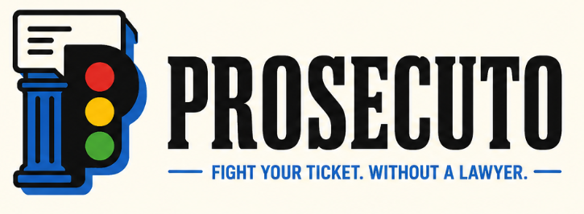
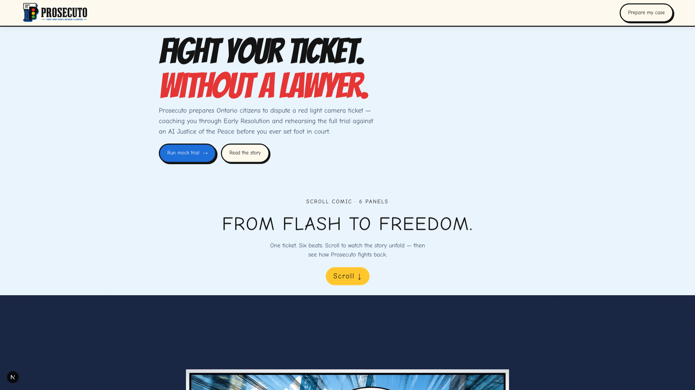
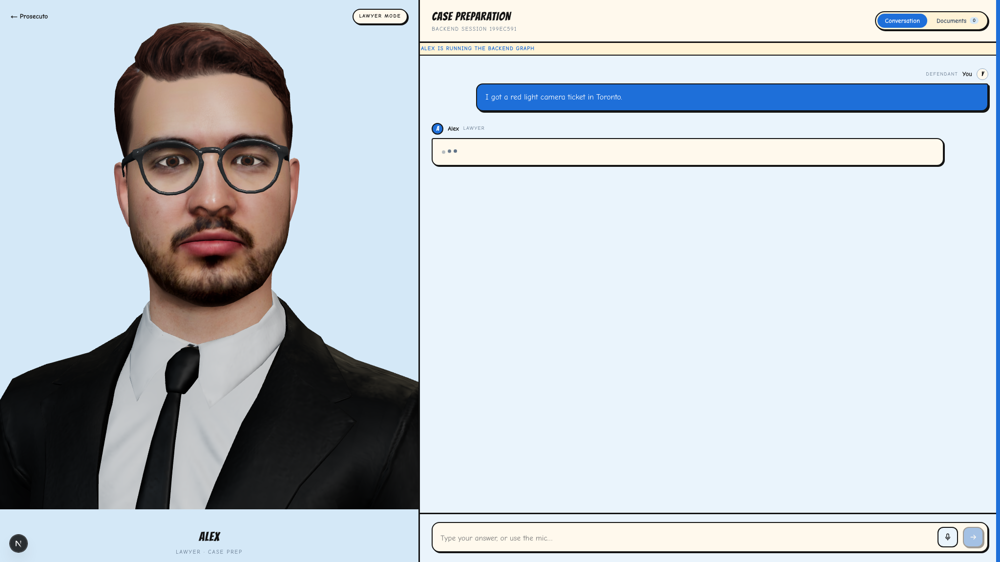
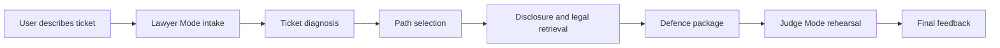
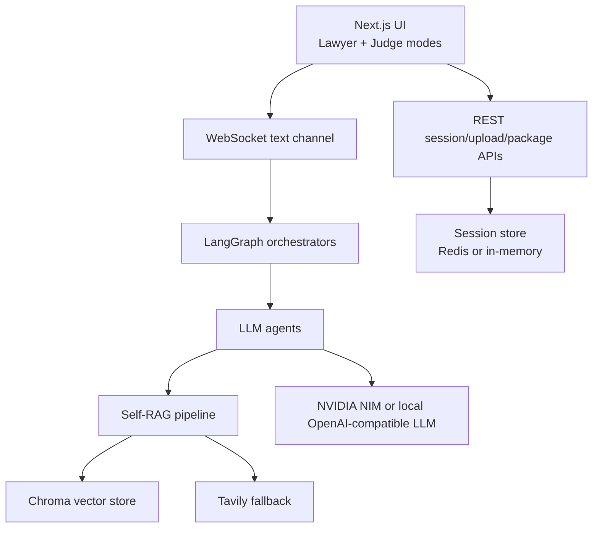
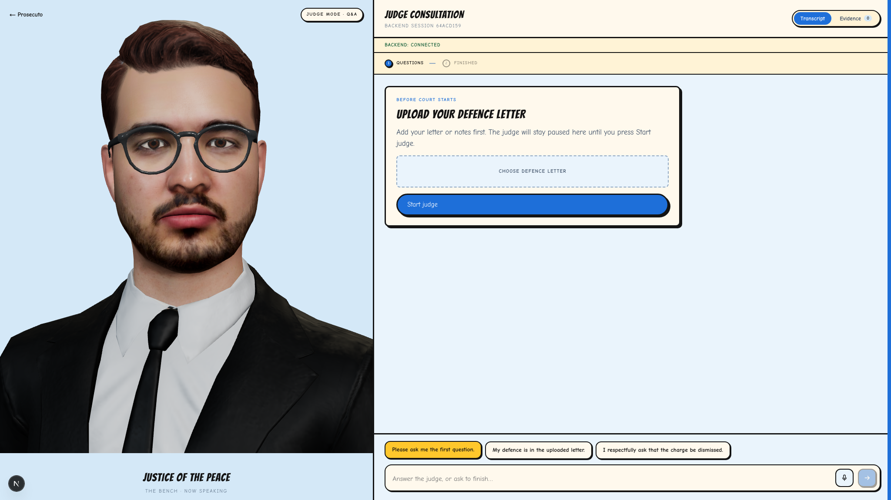

<p align="center">
  
</p>

<h1 align="center">Prosecuto</h1>

<p align="center">
  <strong>An AI-powered Ontario red light camera ticket dispute assistant.</strong>
  <br />
  Prepare your case, generate a defence package, and rehearse with a mock Justice of the Peace.
</p>

<p align="center">
  <a href="#quick-start">Quick Start</a> ·
  <a href="#what-it-does">What It Does</a> ·
  <a href="#architecture">Architecture</a> ·
  <a href="#tech-stack">Tech Stack</a>
</p>

<p align="center">
  
  &nbsp;&nbsp;
  
  &nbsp;&nbsp;
  
</p>

<p align="center">
  
</p>

## Built at NVIDIA Spark Hack Toronto

Prosecuto was built during [NVIDIA Spark Hack - Toronto](https://luma.com/spark-hack-toronto), a hackathon focused on agentic applications powered by open models, high-performance local compute, and real-world utility. The event challenged teams to use Toronto open data and build systems that think, act, and run close to the edge, with teams working on ASUS GX10 hardware powered by the NVIDIA GB10 Grace Blackwell Superchip. Prosecuto applies that local-first agentic idea to a civic/legal workflow: helping people understand and prepare for Ontario red light camera disputes.

## What It Does

Prosecuto turns an intimidating ticket dispute into a guided preparation workflow:

- **Lawyer Mode** interviews the user, extracts ticket details, explains the available dispute paths, and produces a practical preparation package.
- **Documents Mode** presents generated notes and legal materials in a polished drawer with copy and download actions.
- **Judge Mode** lets the user upload a defence letter, then rehearse through a simplified one-judge Q&A mock hearing.
- **RAG-backed legal reasoning** grounds answers in a local Ontario-focused corpus, Chroma retrieval, reranking, and fallback search.
- **3D avatar interface** makes the experience feel more like a live consultation than a static form.

<p align="center">
  
</p>

## Why It Matters

Most people do not know what to ask for, what documents matter, or how to speak clearly in a hearing. Prosecuto does not promise outcomes or replace legal advice. It gives users a structured way to:

- collect the facts that matter;
- understand deadlines and dispute options;
- request and review disclosure;
- identify weak points in the prosecution evidence;
- rehearse answers before a mock decision-maker;
- leave with a usable package instead of a vague chat transcript.

## Core Workflow



## Architecture

Prosecuto is split into a Next.js frontend and a FastAPI backend.



### Backend

- FastAPI application with REST and WebSocket routes.
- LangGraph orchestration for Lawyer Mode and simplified Judge Mode.
- Pydantic schemas for tickets, packages, websocket messages, and session state.
- Chroma-backed retrieval over Ontario legal/procedure documents.
- NVIDIA NIM models for chat, embeddings, and reranking when configured.
- Local OpenAI-compatible LLM support for GB10 / local inference workflows.

### Frontend

- Next.js App Router.
- Comic-inspired landing page and meeting-room interface.
- Three.js avatar mount using the bundled GLB avatar asset.
- Live transcript, document drawer, copy/download actions, voice input, and speech synthesis.

## Tech Stack

| Layer | Tools |
|---|---|
| Frontend | Next.js, React, TypeScript, Three.js |
| Backend | FastAPI, LangGraph, Pydantic, WebSockets |
| Retrieval | Chroma, Self-RAG, NVIDIA embeddings/rerank, Tavily fallback |
| AI Runtime | NVIDIA NIM or local OpenAI-compatible endpoint |
| Storage | Redis when available, in-memory fallback for local dev |
| Hardware context | ASUS GX10, NVIDIA GB10 Grace Blackwell Superchip |

## Quick Start

### 1. Backend

```bash
cd backend
python -m venv .venv
source .venv/bin/activate
pip install -e ".[dev]"
cp .env.example .env
uvicorn app.main:app --reload --port 8000
```

Health check:

```bash
curl http://localhost:8000/api/health
```

### 2. Frontend

```bash
cd frontend
npm install
npm run dev
```

Open:

- Landing page: [http://localhost:3000](http://localhost:3000)
- Lawyer Mode: [http://localhost:3000/lawyer](http://localhost:3000/lawyer)
- Judge Mode: [http://localhost:3000/judge](http://localhost:3000/judge)

## Environment

The backend reads configuration from `backend/.env`.

```bash
NVIDIA_API_KEY=
TAVILY_API_KEY=
REDIS_URL=redis://localhost:6379/0
CHROMA_COLLECTION=prosecuto
LLM_PROVIDER=auto
LOCAL_LLM_ENDPOINT=
LOCAL_LLM_MODEL=qwen3.6-35b
LOCAL_LLM_API_KEY=password
PROSECUTO_GRAPH_RUNTIME=fast_ai
```

If Redis is not running, Prosecuto falls back to in-memory sessions for local development.

## Project Structure

```text
backend/
  app/
    agents/          Lawyer and Judge agents
    api/             REST and WebSocket handlers
    orchestrator/    LangGraph flows and SessionState
    rag/             retrieval, indexing, critics, fallback search
    schemas/         Pydantic models
    voice/           speech and avatar pipeline adapters
  data/
    corpus/          local legal/procedure source documents

frontend/
  app/               Next.js routes
  components/        Lawyer, Judge, avatar, landing components
  lib/               API, voice, text, avatar utilities
  public/assets/     app logo and avatar model
  styles/            product styling
```

## Screens

<p align="center">
  
</p>

## Important Note

Prosecuto is a preparation and education tool. It is not legal advice, does not create a lawyer-client relationship, and does not guarantee any result in court or at an administrative review.

## Acknowledgements

Built for NVIDIA Spark Hack Toronto, with inspiration from the event’s focus on local-first agentic AI, open models, and edge deployment. Thanks to the NVIDIA, ASUS, and Antler ecosystem around the hackathon for the builder context that shaped this project.
